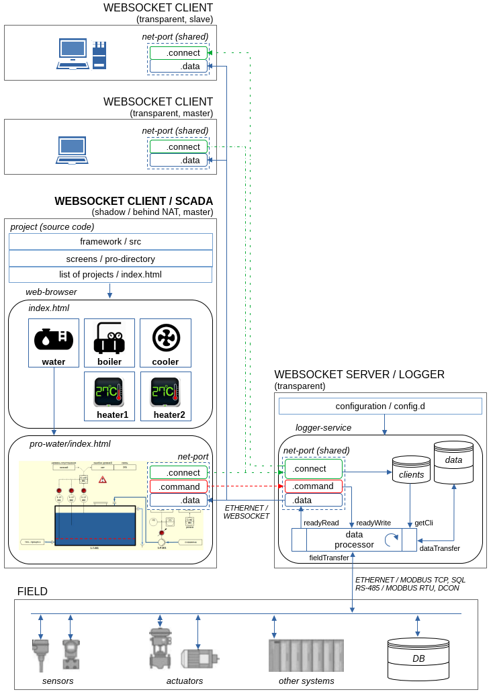

# WebSocket Client / SCADA

See [Releases](https://github.com/atgroup09/websocket-scada-client/releases) to download latest version.

- Documentation
- Source code (+ emulator)

### Hardware Platform

- Any device that supports:
  - Ethernet/LAN interface or WiFi
  - web-browser

### Software Platform

- Any web-browser that supports
  - HTTP, HTTPS, WebSocket
  - HTML5, CSS, JavaScript (jQuery, jQueryMobile, DataTables, FlotCharts)
